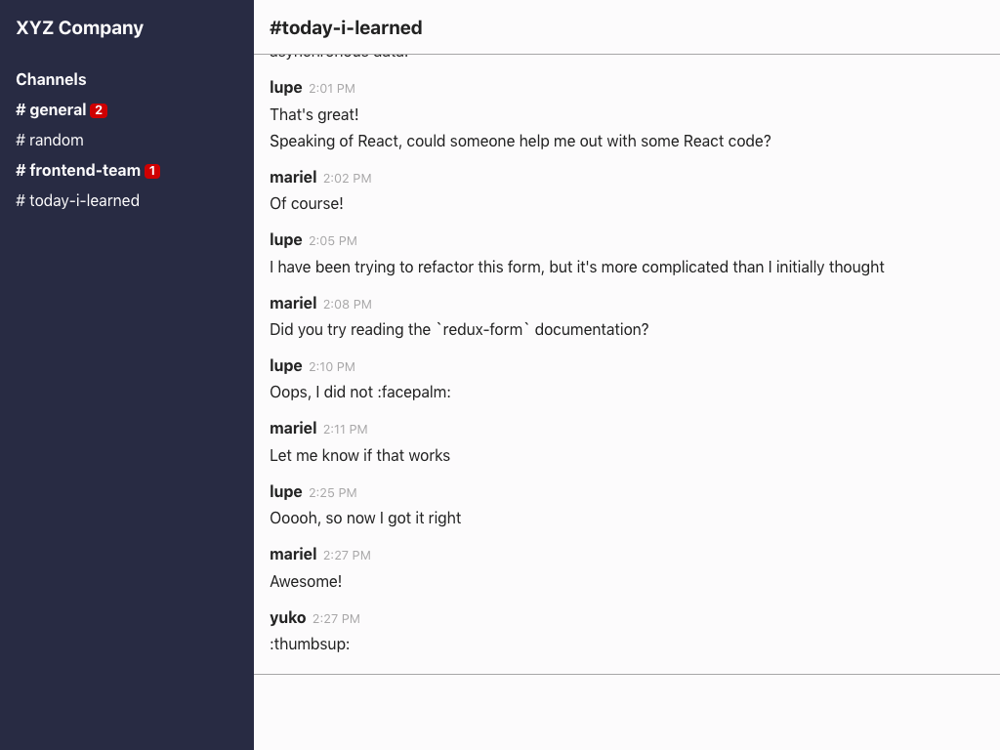

# PayGo frontend code exercise

Welcome to the PayGo code challenge!

<!-- TOC depthFrom:2 depthTo:3 withLinks:1 updateOnSave:1 orderedList:0 -->

- [The challenge](#the-challenge)
	- [Scenario](#scenario)
	- [Mockup](#mockup)
	- [Business requirements](#business-requirements)
	- [Technical requirements](#technical-requirements)
	- [JSON data structure](#json-data-structure)
- [How to run this project](#how-to-run-this-project)
	- [Quick start](#quick-start)
	- [Testing](#testing)
	- [Troubleshooting](#troubleshooting)

<!-- /TOC -->

## The challenge

### Scenario

You've been tasked with prototyping a chat application at XYZ Company that closely resembles a *very* popular collaboration app — let's call our app Not-Slack.  The first iteration of the interface will be a list of channels with an indicator for unread messages, and the list of messages in each channel (no reply feature as of yet.)  You are given a design mockup and static data for your prototype, both documented below.

### Mockup



Note: Your solution does not have to be pixel-perfect, but should follow the visual elements of the mockup as closely as possible.

### Business requirements

- [ ] Clicking on a channel name in the sidebar should show channel messages.
- [ ] The number of unread messages in a channel should be calculated and shown in a red badge next to the channel name.
- [ ] Clicking into a channel should remove the unread message badge.

### Technical requirements

- [ ] Interface should be responsive in screens `768px` wide and up.
- [ ] Write at least one unit test.  All tests should pass.
- [ ] In lieu of API requests, we've provided static JSON files for the channel and messages data. Integrate the data into the app however you see fit. (reference [JSON data structure](#json-data-structure) below)

You must meet all business and technical requirements.  You may take as little or much time as you need to complete these requirements.  However, we recommend spending no more than 3 hours on this code exercise.

You may add open-source JavaScript & React libraries via npm, as long as you provide an explanation of why you used that particular library, either through comments in your code or in your reply email.

### JSON data structure

We've provided static JSON files with the list of channels and messages in `/src/api/data/channels.json` and`/src/api/data/messages.json`.  You can import these files like any other JS file from anywhere in the app:

```js
// App.js
import channels from './api/data/channels';
import messages from './api/data/messages';

console.log(channels); // [{...}]
console.log(messages); // [{...}]
```

Use this mock data in place of fetching data from an actual API.

#### Channel attributes

Attribute | Description  | Type
--------- | ------------ | ------
`id`      | Channel ID   | string
`name`    | Channel name | string

##### Example:

```json
{
  "id": "273",
  "name": "general"
}
```

#### Message attributes

Attribute       | Description                      | Type
--------------- | -------------------------------- | -------
`id`            | Message ID                       | string
`timestamp`     | Message timestamp                | string
`channel_id`    | ID of channel message belongs to | string
`content`       | Message content                  | string
`is_unread`     | Whether message has been read    | boolean
`user`          | Associated user                  | object
`user.id`       | Associated user ID               | string
`user.username` | Associated user's username       | string

##### Example:

```json
{
  "id": "267",
  "timestamp": "1:48 PM",
  "user_id": "408",
  "channel_id": "403",
  "content": "TIL about the React 17 Suspense API.  It lets you suspend component rendering while loading asynchronous data.",
  "is_unread": false,
  "user": {
    "id": "408",
    "username": "yuko"
  }
}
```

---

## How to run this project

This project was bootstrapped with [Create React App](https://github.com/facebook/create-react-app) v2.0.5.  You should have everything you need to get a development environment up and running — if you need more guidance around how the project is set up, check out the [Create React App `README`](README-Create-React-App.md) included in this repo.

### Quick start

First, install dependencies:

```sh
npm install
```

Alternatively, you may use `yarn`:

```sh
yarn
```

After installing dependencies, start the app development server and API server at [localhost:3000](http://localhost:3000):

```sh
npm start
```

With `yarn`:

```sh
yarn start
```

Navigate to [localhost:3000](http://localhost:3000) and update some code.  You should see the browser refresh with the updated code.

### Testing

Run unit tests with `npm` or `yarn`:
```sh
npm test
# or `yarn test`
```

### Troubleshooting

If you run into technical issues starting up the project, check out the [troubleshooting section](README-Create-React-App.md#troubleshooting-1) of the Create React App `README` included in this repo.  You can always reach back out to us if you run into issues that are not covered in the guide.
